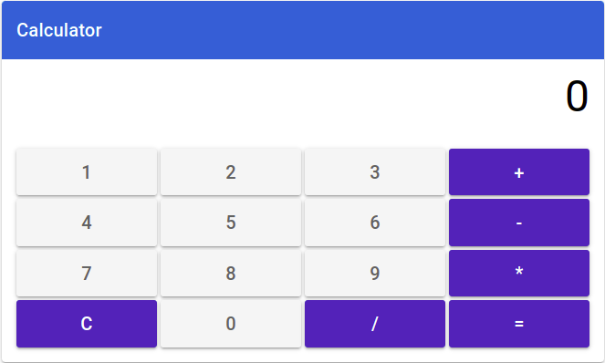
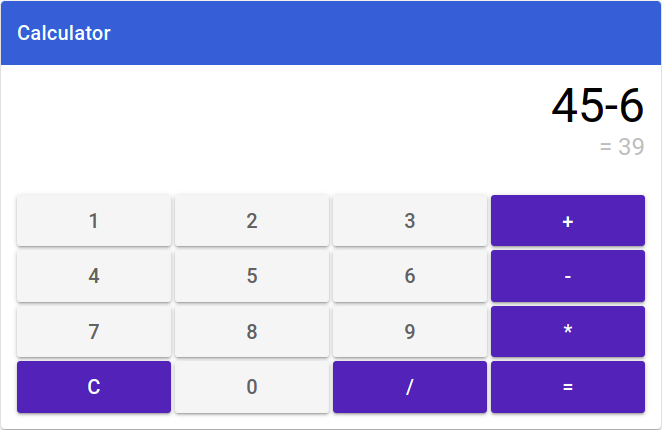

# Quasar Calculator

A simple Quasar calculator project. The goal is to learn Quasar technology along with Vue 3 composition API and Pinia store management.

<p align="center">
  
  
</p>

## Table Of Contents

- [Quasar Calculator](#quasar-calculator)
  - [Table Of Contents](#table-of-contents)
  - [Technologies](#technologies)
  - [Install the dependencies](#install-the-dependencies)
    - [Start the app in development mode (hot-code reloading, error reporting, etc.)](#start-the-app-in-development-mode-hot-code-reloading-error-reporting-etc)
    - [Lint the files](#lint-the-files)
    - [Format the files](#format-the-files)
    - [Build the app for production](#build-the-app-for-production)
    - [Android build](#android-build)
    - [Customize the configuration](#customize-the-configuration)

## Technologies

- [TypeScript](https://www.typescriptlang.org/)
- [Quasar](https://quasar.dev/)
- [Vue 3](https://vuejs.org/)
- [Pinia](https://reactnavigation.org/)
- [MathJS](https://www.npmjs.com/package/mathjs)
- [ElectronJS](https://www.electronjs.org/)

## Install the dependencies

```bash
yarn
# or
npm install
```

### Start the app in development mode (hot-code reloading, error reporting, etc.)

```bash
quasar dev
```

### Lint the files

```bash
yarn lint
# or
npm run lint
```

### Format the files

```bash
yarn format
# or
npm run format
```

### Build the app for production

To build the app in order to deploy it in a server, use the following command:

```bash
quasar build
```

For building Linux app (.deb target) the following configuration has been added to `quasar.config.js`:

```js
electron: {
  bundler: 'builder', // 'packager' or 'builder'

  builder: {
    linux: {
      target: 'deb',
    },
  },
}
```

### Android build

`TODO` The Android build is pending because it requires the installation of Android Studio and other stuff. However, you can follow this steps to prepare Android build:

- Install Java JDK:

```bash
sudo apt-get update
sudo apt-get install openjdk-8-jdk
java -version # Verify good installation
```

- Install Android Studio:
  (https://stackoverflow.com/questions/36198165/failed-to-find-android-home-environment-variable)
  `TODO`

- Add Cordova plugin to Quasar:

```bash
quasar mode add cordova
cd src-cordova
cordova platform add android
cordova requirements # Check if all requirements are met
```

### Customize the configuration

See [Configuring quasar.config.js](https://v2.quasar.dev/quasar-cli-webpack/quasar-config-js).
